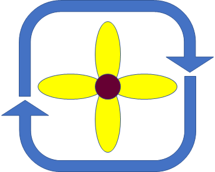
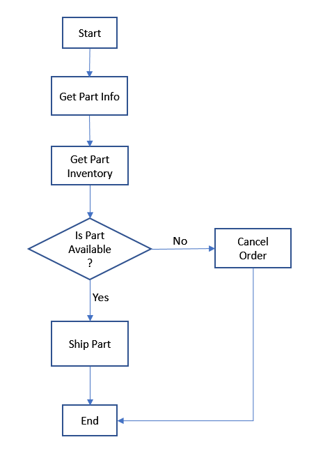
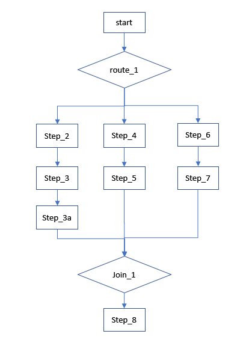
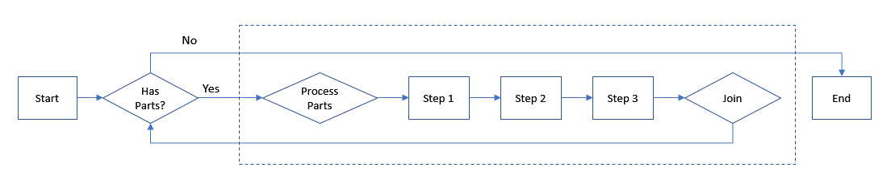

### Flowret – A lightweight Java based orchestration engine

---

#### Whats in a name?
Flowret is derived from the english word "floret" which is in turn derived from the french word "florete".
The word floret means a small / budding flower. We brought in the component of "flow" into this word
and named our orchestrator "Flowret". We felt that this resonated well with the nature of the
orchestrator we have built. It is lightweight, small, a pleasure to use and budding into something beautiful!

---

#### Getting Flowret package

Flowret is available as a jar file in Maven central with the following Maven coordinates:

````pom
<groupId>com.americanexpress.unify.flowret</groupId>
<artifactId>unify-flowret</artifactId>
<version>1.7.1</version>
````

---

#### Prerequisites
Flowret works with Java 8 and later.

Make sure that log4j configuration file is found in the class path.

---

#### Glossary
Term | Description
---- | -----------
Process Definition | A defined sequence of steps (sequential / parallel) and routing information
Case | An instance of a process definition. Note that the words case and process are used synonymously
Step | An invokable action in a process definition that does a defined piece of work usually executed on the application
Route | A conditional step that determines a path which a case takes
Singular Route | A route from which only one of the outgoing paths can be chosen for case execution
Parallel Route | A route from which one or more of the outgoing paths can be chosen for case execution and the paths are known in advance
Parallel Route Dynamic | A route which has only one outgoing branch, the steps on which are executed in parallel as determined by the parallel dynamic route
Process variables | Case specific variables required for routing a case through the process flow
SLA Milestone | An action to be taken at a specified time in the future

---

#### Design Goals
* Extreme flexibility in stitching together journeys
* Enable true technical parallel processing enabling faster performance and SLAs
* Simplify process definition. Keep things as simple as possible
* Scale horizontally
* Cloud deploy-able
* Extreme reliability. Be able to withstand JVM crashes

---

#### Architecture
* Core Java 8.0. Only depends on custom JDocs library which in turn depends on
Jackson JSON parsing open source library
No dependency on non-core heavy weight or commercial products
* Packaged as a JAR less than ~300 KB
* Runs as an embedded orchestrator in the host application making
it horizontally scale-able along with the application

---

#### Capability and Feature Summary

##### Process Definition

1. Very simple process definition comprising of steps and routes in a JSON file
1. Very simple SLA milestone definition (SLA definition in short) comprising of a list of milestones in a JSON file
1. Ability to define singular, static parallel or dynamic parallel routes
1. Ability to hook up a route to an application rule to determine path to take
1. Case instance specific copy of process definition and SLA Milestone definition at case start.
Locks both the process definition and SLA definition for a case for its life time
thereby eliminating errors due to definitions changing while a case is being processed

##### Parallel Processing
1. An extremely critical feature required to reduce end to end processing time for a
case
1. True parallel processing available out of box. As a side note, most of the mainstream
BPM products do not offer true technical parallel processing.
They offer business parallel processing in which while one can have multiple branches
emanating from a route, they will still be executed one at a time.
1. Except for synchronization of application specific data structures, no additional work around enabling parallel
   processing is required to be done on the application / consumer side. Parallel processing is completely managed by
   Flowret as specified in the process definition file
1. Configurable number of threads from a pool used for parallel processing or unbounded child threads - the choice is
   yours

##### State Management
1. Implements "resume from where it left off" functionality
1. Can support multiple data stores to persist state via a published API including
RDBMS / NoSQL / File System. File system is a quick and efficient way to test
on laptop in stand alone isolated mode
1. Allows applications to specify “execute next on resume” or “execute self on resume”
(only in case of a non-error pends) conditions on case resume
1. Configurable state persistence by specifying a special “Persist” step anywhere
in the process definition or when process pends / completes
1. "Write state information immediately" mode wherein the orchestrator updates state information
immediately after it executes a step or a route. This makes it crash proof to the last but one executed
step / route

##### Audit Logging
1. Audit log of all execution paths and process variables written out after execution of each step / route
2. Minimizes the possibility of having orphaned cases
(cases where we do not know which step was executed last due to data loss due to a crash)

##### Ticket Management
1. “Go to step” feature implemented via tickets
1. Ticket can be raised by any step
1. On a ticket being raised, control gets transferred to the step
specified in the ticket definition

###### Ticket Example 1
Assume an application processing workflow that contains 40 steps and each step can raise an approved or declined
decision. In case of a decline by any step, control needs to get routed to the last step.
In the absence of this feature, the return from each step would need to be
conditionally evaluated in a route. This would make the process definition
messy, tedious to build, cumbersome to use and error prone to maintain.
This ticket feature would eliminate the need to specify an evaluation condition
after each step thereby keeping the process definition clean and focused on business flow.

##### Process Variables
1. Ability to define process variables with initial values as part of process definition
1. Ability to provide all process variables to steps and routes invoked as part of process flow
1. Ability for each step / route to modify existing / add new process variables to the case
1. All process variables persisted in audit logs and state persistence

###### Process variable example 1
In a parts ordering application,
there may be more than one parts to order. Each part needs to be taken
through a set of steps. A process variable “curr_part”
may be used to maintain the information of which instance of part is being currently processed

###### Process variable example 2
In an ordering application, the customer might not specify the address to ship the order to. A
process variable “is_address_available” could be used with initial value false to start with.
After the customer provides the address information, this variable could be set to true.
This variable would be used for routing e.g.
if it is false, take the application to the step where we request address information
from the customer else not

##### Quality
1. Can be run as a stand alone Java application on a laptop
1. Steps and routes can be easily mocked for testing various permutations and combinations of routing
1. A journey can be tested independently using mocks of steps / routes. This helps decouple
the journey definition and testing from the actual implementation of the steps
and routes

##### Application call back Events
1. Ability to provide call back events to applications / consumers e.g.
on process start, on process pend etc.
1. The application may use these call back events for house-keeping tasks
and data synchronization during parallel processing. Example -> on process resume event,
the application may load data into memory and on process pend,
may write the data back to database and release memory

##### Crash proof	
1. Ability to write out the state of the process after execution of each step and route
1. Provides the following variables which can be used to identify "orphaned" cases
    1. "pend_exec_path" - the name of the execution path if case is pended else empty
    1. "is_complete" - a flag indicating the status of the case
    1. "ts" - the timestamp when the status was saved
1. On resuming such an orphaned application, the correct state is automatically
reconstructed and process resumes from the state it recorded last
1. An application batch process could scan the process info files to identify
cases which have pend_exec_path as empty (meaning that the process is running),
is_complete as false and a timestamp which is x units exceeded
(as per application needs) and could resume such cases in a batch mode

#### SLA and work management

1. Maintains information of work baskets into which cases are parked
1. Provides a work manager which can be used to switch work baskets for a case and carry out actions on change of a work
   basket
1. Provides an SLA manager which can be used to define, enqueue and dequeue SLA milestones automatically based on the
   SLA configuration defined

---

#### Getting started in 5 minutes

Please refer to the packages `com.americanexpress.unify.flowret.sample` and `/resources/flowret/sample` in the test
folder. All Java class files and resources described below can be found there. You can also run the sample by running
the file `FlowretSample.java`.

In case you would like to create your own project and copy the sample files there, please note the following:

1. Make sure that unify-flowret dependency is downloaded and on the class path
2. Make sure that log4j2.json is found in the root of the resources path of your project. You can take a sample from the
   location `/resources/log4j2.json` in the test folder

##### Step 1: Create a process definition file

Please refer to the file `/resources/flowret/sample/order_part.json` under the test folder. The contents of this file
are the same as the contents of the process flow as defined in the next section "Defining a process".

##### Step 2: Create an object to persist Flowret data

Please refer to the file `com.americanexpress.unify.flowret.sample.SampleDao.java` in the test folder.

This object is used by Flowret to read from / to the data store. The data store may be an RDBMS, a NoSQL or for simple
testing even a file system. In our sample, this object reads and writes from / to a file system.

This is Flowret's way of saying - "Give me an object which I can use to persist my state and audit data".

You will note that this object expects to be provided a path to a valid directory on the file system. More on this later
in step 7.

##### Step 3: Create a sample step

Please refer to the file `com.americanexpress.unify.flowret.sample.SampleStep.java` in the test folder.

This is the object returned by a component factory and represents a step to be executed. This object implements
the `InvokableStep` interface.

This is Flowret's way of saying - "Give me an object that represents a step I want to execute on which I can call
the `executeStep` method".

You will note here that we have a single class file to represent all steps in the process definition. In reality,
applications may have one class for one step.

##### Step 4: Create a sample route

Please refer to the file `com.americanexpress.unify.flowret.sample.SampleRoute.java` in the test folder.

This is the object returned by a component factory and represents a route to be executed. This object implements
the `InvokableRoute` interface.

This is Flowret's way of saying - "Give me an object that represents a route I want to execute on which I can call
the `executeRoute` method".

Again, you will note here that we have a single class file to represent all routes in the process definition. In
reality, applications may have one class per route.

##### Step 5: Create a sample component factory

Please refer to the file `com.americanexpress.unify.flowret.sample.SampleComponentFactory.java` in the test folder.

This is the object which is invoked by Flowret whenever it wants to execute a step or a route. Flowret tells this object
what type of entity is being run e.g. a step or a route (via the process context variable). In return, it expects to be
returned an object of the right type i.e. an object which implements `InvokableStep` in case of a step (`SampleStep` in
our example) and an object which implements `InvokableRoute` in case of a route
(`SampleRoute` in our example).

This is Flowret's way of saying - "Give me a factory which I can call to get a Step or a Route to execute".

##### Step 6: Create a sample event handler

Please refer to the file `com.americanexpress.unify.flowret.sample.SampleEventHandler.java` in the test folder.

This is the object to which Flowret delivers the case lifecycle events like ON_PROCESS_START etc. This object implements
the `EventHandler` interface.

This is Flowret's way of saying - "Give me an object to which I can deliver case lifecycle events".

##### Step 7: Create a main program and run the sample process

***When you run this program, the first thing it does is delete all files in the directory specified. Hence please take
care to not point it to a directory where you may have content.***

Please refer to the file `com.americanexpress.unify.flowret.sample.FlowretSample.java` in the test folder.

Please note the following:

1. The directory path used for reading and writing Flowret files is `C:/Temp/flowret/`. You can change it to whatever
   works for you. Note that this is a Windows path. If you are on Mac, please change this path accordingly
2. The directory path should be a valid path and should already exist. Ideally, you want to to make sure it is empty to
   start with

###### Initialize Flowret

```java
ERRORS_FLOWRET.load();
Flowret.init(10, 30000, "-");
Flowret.instance().setWriteAuditLog(true);
Flowret.instance().setWriteProcessInfoAfterEachStep(true);
```

###### Wire up objects and get runtime service

```java
SampleFlowretDao dao = new SampleFlowretDao(DIR_PATH);
SampleComponentFactory factory = new SampleComponentFactory();
SampleEventHandler handler = new SampleEventHandler();
Rts rts = Flowret.instance().getRunTimeService(dao, factory, handler, null);
```

###### Get process definition and start the case

Note that we start a case with case id as 1.

```java
String json = BaseUtils.getResourceAsString(FlowretSample.class, "/flowret/sample/order_part.json");
rts.startCase("1", json, null, null);
try {
   while (true) {
     logger.info("\n");
     rts.resumeCase("1");
   }
}
catch (UnifyException e) {
  logger.error("Exception -> " + e.getMessage());
}
```

Note that we have a while loop that tries to resume the case till it hits an exception. This is to resume the case
multiple times in case of more than one pends (one resume for each pend) and take the case to completion.

You can see the logs in the console which will tell you of the progress. You may safely ignore the last exception
message shown below.

```java
[americanexpress.unify.flowret.sample.FlowretSample] ERROR:Exception -> Cannot resume a case that has already completed.Case id -> 1
```

##### Step 8: Experiment a bit

Try suppressing the writing of `flowret_audit_log` files by specifying below in `FlowretSample.java`:

```java
Flowret.instance().setWriteAuditLog(false);
```

Return a pend from a step and see what happens. You can refer to below code (already available as commented
in `SampleStep.java` file):

```java
if (compName.equals("get_part_info")) {
  return new StepResponse(UnitResponseType.OK_PEND, "", "SOME_WORK_BASKET");
}
```

Return an error pend randomly 50% of the time. The program will resume the case till there is no pend and take it to
completion.

```java
int value = new Random().nextInt(2);
if (value == 0) {
  return new StepResponse(UnitResponseType.OK_PROCEED, "", "");
}
else {
  return new StepResponse(UnitResponseType.ERROR_PEND, "", "ERROR_WORK_BASKET");
}
```

##### Step 9: Run unit test cases

Try running the unit tests which are defined under the following folders in the test package:

1. test_singular - single path of execution test cases
2. test_parallel - parallel processing test cases
3. test_parallel_dyn - dynamic parallel processing test cases
4. test_parallel_in_dyn_parallel - parallel processing within dynamic parallel processing test cases

Please note that there are some test cases for which assertions are yet to be done. These test cases can however
be run and their output examined manually for understanding and correctness. You can identify such
test cases from the console output when you run all test cases.

Each test case class has the following two variables which are switched off by default:

```java
private static boolean writeFiles = false;
private static boolean writeToConsole = false;
``` 

Turning on the ```writeFiles``` variable will write the process info and audit log files to the directory specified.
Note that there is a subdirectory created for each test case class and inside that for each test case.
It would be your responsibility to clean up any contents in these directories should you want to do so.

Turning on the ```writeToConsole``` will output the log messages to console. This is useful when you want to see the
progress of the test case execution.

---

#### Defining a process

A process is defined in a JSON file. Consider a simple workflow to order a specific part:



The following would be the JSON for representing this flow:

```json
{
  "journey": {
    "name": "order_part",
    "tickets": [
      {
        "name": "cancel_order",
        "step": "step_4"
      }
    ],
    "process_variables": [
      {
        "name": "user",
        "type": "string",
        "value": "Jack",
        "comment": "The name of the person who has raised this order"
      }
    ],
    "flow": [
      {
        "name": "start",
        "component": "start",
        "next": "step_1"
      },
      {
        "name": "step_1",
        "type": "step",
        "component": "get_part_info",
        "user_data": "Any data can go here",
        "next": "step_2",
        "comment": "Get detailed information for the requested part"
      },
      {
        "name": "step_2",
        "component": "get_part_inventory",
        "next": "route_1"
      },
      {
        "name": "route_1",
        "type": "s_route",
        "component": "is_part_available",
        "branches": [
          {
            "name": "Yes",
            "next": "step_3"
          },
          {
            "name": "No",
            "next": "step_4"
          }
        ]
      },
      {
        "name": "step_3",
        "component": "ship_part",
        "next": "end"
      },
      {
        "name": "step_4",
        "component": "cancel_order",
        "next": "end"
      }
    ]
  }
}
```

##### Notes:

**The tickets block**

This block consists of an array, each element of which denotes a ticket.
A ticket is defined using the following two fields:
1. `name` - name of the ticket
2. `step` - name of the step where the control needs to be routed to in case this ticket is raised

In the above example, it is possible for step_1 to raise a ticket (in case it sees that it is a duplicate application,
in which case control will get transferred to `step_4` (decline application)

**The process variables block**

This block consists of an array of process variables defined by the following fields:
1. `name` - name of the process variable
2. `type` - type of the variable. Can be one of the following values:
    1. `string`
    2. `boolean`
    3. `long`
    4. `integer`
3. `value` - starting out value. Always stored as a string but converted to the appropriate data type
while reading or writing
4. `comment` - any comment associated with the variable. This is an optional field

Note that process variables and their values defined in the process definition file consist of an initial set only.
Process variables can always be updated / added by steps / routes as we go along in the process.

All process variables are made available to steps and routes via process context. The step or route implementations
in the application domain can update the process variables i.e. add new variables, delete existing variables
and update the values of existing variables.
 
**The flow block**

This block consists of an array of units. The different kinds of units are:
1. Step
1. Route
1. Parallel Join
1. Persist
1. Pause

The structure of the unit for each type is described below:

**Step**
1. `name` - name of the step - has to be unique across all units in the process definition
2. `type` - type of the unit. Value is `step`. Optional. If not present, the unit is assumed to be of type `step`
3. `component` - name of the component. This points to a specific component in the application domain.
Flowret while executing a step will provide this component name (as part of the process context)
to the given application process component factory. The application factory is free to use
the component name in what ever way it deems appropriate
4. `user_data` - user data - this will be passed in the process context object when a step or route is invoked. This
could be used to specify any additional information to be passed to the application via the process context. Optional
5. `comment` - any comment associated with this unit. This is an optional field
6. `next` - this specified the next unit to be executed

**Route**
1. `name` - name of the route - has to be unique across all units in the process definition
2. `type` - type of the unit. Following are the values
    1. `s_route` - a singular route
    1. `p_route` - a static parallel route
    1. `p_route_dyn` - a dynamic parallel route
3. `component` - name of the component. Same as for a step
4. `user_data` - user data. Same as for a step. Optional
5. `comment` - same as for a step. Optional
6. An array of elements, each denoting a branch which is defined using the following fields:
    1. `name` - name of the branch
    2. `next` - next component to be executed for this branch

**Parallel Join**
1. `name` - name of the join - has to be unique across all units in the process definition
2. `type` - type of the unit. Value is `p_join`

**Persist**
1. `name` - name of the persist step - has to be unique across all units in the process definition
2. `type` - type of the unit. Value is `persist`

**Pause**
1. `name` - name of the pause step - has to be unique across all units in the process definition
2. `type` - type of the unit. Value is `pause`

---

#### Creating a parallel processing flow

Parallel processing in a flow can be easily incorporated by using `p_route` / `p_route_dynamic` and `p_join` constructs.
Below is a sample parallel processing flow:



And the process definition json for this flow:

```json
{
  "journey": {
    "name": "parallel_test",
    "flow": [
      {
        "name": "start",
        "component": "start",
        "next": "route_1"
      },
      {
        "name": "route_1",
        "type": "p_route",
        "component": "route_1",
        "branches": [
          {
            "name": "1",
            "next": "step_2"
          },
          {
            "name": "2",
            "next": "step_4"
          },
          {
            "name": "3",
            "next": "step_6"
          }
        ]
      },
      {
        "name": "step_2",
        "component": "step_2",
        "next": "step_3"
      },
      {
        "name": "step_3",
        "component": "step_3",
        "next": "step_3a"
      },
      {
        "name": "step_3a",
        "component": "step_3a",
        "next": "join_1"
      },
      {
        "name": "step_4",
        "component": "step_4",
        "next": "step_5"
      },
      {
        "name": "step_5",
        "component": "step_5",
        "next": "join_1"
      },
      {
        "name": "step_6",
        "component": "step_6",
        "next": "step_7"
      },
      {
        "name": "step_7",
        "component": "step_7",
        "next": "join_1"
      },
      {
        "name": "join_1",
        "type": "p_join",
        "next": "step_8"
      },
      {
        "name": "step_8",
        "component": "step_8",
        "next": "end"
      }
    ]
  }
}
```

**Constraints on parallel processing**

While enabling parallel processing in flows, the following need to be observed:
1. Flowret will execute each branch on a separate thread. Any synchronization issues on the application
side (due to shared variables etc.) need to be handled by the application. This does
not apply to the application changing process variables as access to process variables is internally synchronized
by Flowret
2. All outgoing branching from a `p_route` must converge to a corresponding `p_join`
3. In case a ticket is raised on a branch executing on a parallel processing thread, it must refer to a step
which would have executed on the single processing thread of the process. This means that the
step should be outside of the outest `p_route` / `p_join` construct 

---

#### Initialize Flowret - needs to be done only once at startup

```java
  Flowret.init(idleTimeout,typeIdSep);
        Flowret.init(idleTimeout,typeIdSep,errorWorkbasket);
        Flowret.init(maxThreads,idleTimeout,typeIdSep);
        Flowret.init(maxThreads,idleTimeout,typeIdSep,errorWorkbasket);
```

`int maxThreads`

Specifies the maxiumum number of threads in an executor eervice pool used for parallel processing.

This variable only comes into picture when Flowret has to do parallel processing. For single threaded process execution,
the caller thread is used to run the process.

The parallel processing can be setup in two ways. If the value of this variable is specified and is more than 0, then
this specifies the maximum number of threads which can be used in parallel processing across cases. This is important to
understand - Flowret will internally create a thread pool with so many threads and each time it is required for a
parallel path to be executed, a thread from this pool will be used. This is a fixed thread pool which allows clients to
specify an upper bound on the number of threads to be used for parallel processing.

In case the value passed for this variable is less than or equal to 0, Flowret will create threads on the fly with no
upper bound. Note that, in this option, there may be a very small impact on performance as each time a parallel path is
to be executed, a new thread will be created (
as compared to the fixed thread pool where the threads are already created and ready to run). Very important to note is
that this option is not bounded. In other words, clients could run multiple parallel processing cases such that the pod
gets overwhelmed with the high number of threads / processing. It is left up to the clients to take care of such
scenarios and put some kind of safe guards.

`int idleTimeout`

Specifies the idle time of a thread in the parallel processing thread pool after which it will be terminated to conserve
system resources.

`String typeIdSep`

Specifies the character to be used as the separator between the type and id fields in the name of the document to be
written to the data store (via dao object). Flowret uses the following document naming
convention `<type><separator><id>`

`String errorWorkBasket`

Specifies the name of the work basket to be used in case Flowret encounters an error after the step / route has been
executed but Flowret encounters an error while processing the application event or encounters an internal error. This
value will be written out to the process info file.

At this point of time, we can describe the various documents that Flowret writes to the data store as it executes a
case.

1. Audit Log - a document that stores the state of the execution paths and process variables after execution of each
   step / route
   1. Type - `flowret_audit_log`
   1. Separator - `-`
   1. id - `<case_id>_<sequence_number>_<step_name>`
    1. Example - `flowret_audit_log-1_00001_step_13`
1. Journey - the document that stores the process definition which a case needs to execute
    1. Type - `flowret_journey`
    1. Separator - `-`
    1. id - `<case_id>`
    1. Example - `flowret_journey-1`
1. Process Info - the document that stores the latest state of the process in terms of
execution paths and process variables
    1. Type - `flowret_process_info`
    1. Separator - `-`
    1. id - `<case_id>`
    1. Example - `flowret_process_info-1`

---

#### Get an instance of Flowret
Flowret is a singleton object.

```java
Flowret flowret = Flowret.instance();
```

---

#### Get runtime service of Flowret
```java
Rts rts = Flowret.getRunTimeService(dao, factory, handler, SlaQueueManager);
```

The application is expected to provide the following objects
to the run time service for Flowret to use:

`FlowretDao dao` specifies an object that implements the `FlowretDao` interface as below.
This object will be used to persist the state of the process.

```java
public interface FlowretDao {
  public void write(String key, Document d);
  public Document read(String key);
  public long incrCounter(String key);
}
```

`ProcessComponentFactory factory` specifies an object that implements the `ProcessComponentFactory` interface
as below. This object is called upon to create an instance of the class
on which the execute method of a step or a route will be invoked. Flowret will pass the
process context to this object.

```java
public interface ProcessComponentFactory {
  public Object getObject(ProcessContext pc);
}
```
The object returned by the above implementation must implement the interface `InvokableStep`
in case a step is to be executed or `InvokableRoute` in case a route is to be executed. The passed process context
contains details of the step or route to be executed which include the name of the component
in the application domain which represents the step or route.

```java
public interface InvokableStep {
  public StepResponse executeStep();
}

public interface InvokableRoute {
  public RouteResponse executeRoute();
}
```

`Event Handler handler` specifies an object that implements the `EventHandler` interface as below. Methods on this
object will be invoked to inform the application of process life cycle events.

```java
public interface EventHandler {
  public void invoke(EventType event, ProcessContext pc);
}
```

`ISlaQueueManager slaQm` specifies an object that implements the `ISlaQueueManager` interface. This is
described later in the section on SLA milestone management.

---

#### Flowret Application Events
Flowret will inform the application of the following events types via the invoke method of the EventHandler object:

```java
public enum EventType {
  ON_PROCESS_START,
  ON_PROCESS_RESUME,
  ON_PROCESS_PEND,
  ON_PROCESS_COMPLETE,
  ON_TICKET_RAISED,
  ON_PERSIST
}
```

---

#### Flowret Process Context

Along with the event type, the process context will also be passed. The process context is provided as an instance
of class `ProcessContext` which has the following fields which can be accessed via the getter methods:

```java
  private String journeyName; // name of the journey / work flow being executed
  private String caseId; // the case id of the instance of the journey
  private String stepName; // the step name
  private String compName; // the component name
  private String userData; // the user data associated with the step / route as specified in the process definition json
  private UnitType compType; // the type of the unit i.e. step or route
  private String execPathName; // the name of the execution path
  private ProcessVariables processVariables; // the object containing the process variables
  private String pendWorkBasket; // the work basket into which the application has pended
  private ErrorTuple pendErrorTuple; // the details of error in case the application had pended with an error
  private String isPendAtSameStep; // tells us if the pend has taken place on the same step or the pend has
                                   // taken place after the application has moved forward
```

The process context variables will be set as below while invoking events. Other variables will be set to null:

```text
* ON_PROCESS_START
    * journeyName
    * caseId
    * processVariables
    * execPathName - this will be set to "." denoting the starting root execution path
    
* ON_PROCESS_PEND
    * journeyName
    * caseId
    * stepName - where process has pended
    * compName - the name of the component corresponding to the step
    * userData
    * compType
    * processVariables
    * execPathName - the name of the execution path on which the pend has occurred
    * pendWorkBasket
    * pendErrorTuple
    * isPendAtSameStep
    
* ON_PROCESS_RESUME
    * journeyName
    * caseId
    * processVariables
    * execPathName - this will be set to "." denoting the starting root execution path
    * stepName - where process had pended
    * compName - the name of the component corresponding to the step
    
* ON_PROCESS_COMPLETE
    * journeyName
    * caseId
    * stepName - which last executed
    * compName - the name of the component corresponding to the step
    * userData
    * compType
    * processVariables
    * execPathName - the name of the execution path which executed the last step
    
* ON_TICKET_RAISED
    * journeyName
    * caseId
    * stepName - where process has pended
    * compName - the name of the component corresponding to the step
    * userData
    * compType
    * processVariables
    * execPathName - the name of the execution path on which the pend has occurred
    
* ON_PERSIST
    * journeyName
    * caseId
    * execPathName - the name of the execution path on which the pend has occurred
```

---

#### Note on Execution Paths

An execution path is the thread on which a step or a route in the process is executed. When a process is started, 
it is always on the root thread denoted by `.` as the execution path. Whenever a parallel route is encountered,
number of threads equal to the number of outgoing branches are started. Each thread represents an execution path and
is named by appending the route name and the branch name to the parent execution path.
Taking an example, if the name of the parallel route is ``route_1`` and the names of the three
outgoing branches are `1`, `2` and `3`, then the execution paths will be named as:

1. `.` - representing the root thread
1. `.route_1.1.` - execution path for the thread for the first branch
1. `.route_1.2.` - execution path for the thread for the second branch
1. `.route_1.3.` - execution path for the thread for the third branch

The character `.` is used to represent the starting root execution path. It is also used as the delimiter 
for appending. For example, `.route_1.1.` comprises of the following:
1. `.` representing the root thread appended by
1. `route_1` representing the name of the route from where the new execution path emanated from appended by
1. `.` the delimiter appended by
1. `1` representing the name of the branch appended by
1. `.` the delimiter for more execution paths to come

Talking of a case when there is further parallel processing encountered on the execution path `.route_1.1.`
from a parallel route named `route_2` and the first branch being `1`, the execution path for this branch
would be named as `.route_1.1.route_2.1.`   

Any levels of nesting and parallel procssing are supported using the above naming construct.

**CAUTION** -> *As a result of the above naming convention, it derives that the use of the delimiter character `.` is not allowed
to be part of the route name or the branch name.*
 
--- 

#### Start a case

Invoke below method on run time service:

```java
rts.startCase(caseId, journeyName, journeyJson, processVariables, journeySlaJson);
```

`String caseId` specifies the id for the case to be created. This needs to be unique.
Flowret will throw an exception in case the case id already exists.

`String journeyName` specifies the name of the process for which the case is being created.

`String journeyJson` specifies the sequence of steps and routes that comprise the process.

`ProcessVariables processVariables` is a collection of variables that are
made available to steps and routes. The process variables can be updated by steps and routes.

`String journeySlaJson` specifies the SLA Milestones for the process. This is detailed out in the secition on SLA
Milestones later in this document. A null value can be passed in case no SLA milestones are to be used.

This methods throws an exception if the case could not be started.

This method will internally start the process execution and return when either the process pends or when it finishes.

At the time of starting the case, Flowret also writes out a copy of the process definition associated
with the case. This locks the process definition to the case
for its life time. This is used to ensure that in flight applications are not impacted in case the
main process definition changes.

---

#### Execution of process flow

When a case is started or resumed, Flowret startes executing the workflow defined in the journey file.
For each step / route encountered, it invokes the `getObject` method in the `ProcessComponentFactory` object provided
by the application. Then it invokes either `invokeStep` or `invokeRoute` method on this object
depending upon whether the unit being executed is a step or route. The application responds back to Flowret
via the return objects of these two methods i.e. `StepResponse` or `RouteResponse`. These objects allow the application
to set the following:

1. Raise a ticket
1. Set the unit response type

The above are set when the application creates the object using the constructor.

**StepResponse**

The `StepResponse` class looks like this. Note that it is only a step which is allowed to raise a ticket.

```java
public class StepResponse {
  private UnitResponseType unitResponseType = null;
  private String ticket = "";
  private String workBasket = "";
  private ErrorTuple errorTuple = new ErrorTuple();

  public StepResponse(UnitResponseType unitResponseType, String ticket, String workBasket) {
    // ...
  }

  public StepResponse(UnitResponseType unitResponseType, String ticket, String workBasket, ErrorTuple errorTuple) {
    
  }

  public UnitResponseType getUnitResponseType() {
    // ...
  }

  public String getTicket() {
    // ...
  }

  public String getWorkBasket() {
    // ...
  }

  public ErrorTuple getErrorTuple() {
    // expected to be set by the application if it is pending with an error
  }

}
```

**RouteResponse**

The `RouteResponse` class looks like this.

```java
public class RouteResponse {
  private UnitResponseType unitResponseType = null;
  private List<String> branches = null;
  private String workBasket = "";
  private ErrorTuple errorTuple = new ErrorTuple();

  public RouteResponse(UnitResponseType unitResponseType, List<String> branches, String workBasket) {
    // ...
  }

  public RouteResponse(UnitResponseType unitResponseType, List<String> branches, String workBasket, ErrorTuple errorTuple) {
    // ...
  }

  public UnitResponseType getUnitResponseType() {
    // ...
  }

  public List<String> getBranches() {
    // ...
  }

  public String getWorkBasket() {
    // ...
  }

  public ErrorTuple getErrorTuple() {
    // expected to be set by the application if it is pending with an error
  }

}
```

Note that a route response can return a list of branches. The following
should be adhered to:

* In case of a route response from a singlular route i.e. `s_route`, only one branch should be returned in the list
as a singular route can take one and only one of the many outgoing branches. In case the implementation
return more than one branch in the list, the first one would be used.
* In case of a route response from a parallel route, the implementation can return one or more branches in the list.
For example, if there are three branches emanating from the parallel route in the process, the implementation
can return upto three branches. Remaining ones will be ignored by Flowret.
* In case of route response from a dynamic parallel route, the implementation can return more than one
branches. There is no upper limit although implementations are advised to keep this number reasonable so as
to not overwhelm the JVM.

Needless to say, the name of the branch returned should match with the name specified in the process definition.

The application can set the unit response type to one of the following:

```java
public enum UnitResponseType {
  OK_PROCEED,
  OK_PEND,
  OK_PEND_EOR,
  ERROR_PEND
}
```

`OK_PROCEED` tells Flowret to move ahead in the process. This means that all is OK and the process should move ahead

`OK_PEND` tells Flowret to pend but execute the next step when it is resumed. This means that all is OK but we need to
pend the process and when the process is resumed, the next unit should be called

`OK_PEND_EOR` tells Flowret to pend but execute this step (the one that is causing the pend) again when the
process is resumed. EOR stands for execute on resume.

`ERROR_PEND` tells Flowret to pend as an error has occurred. In such case, this step will always be executed
when the process is resumed

**What happens if multiple branches in a parallel process pend?**

In the case of the parallel flow described previously, it is possible for more than one branch to pend.
Flowret, in such a case will record all pends but will return the pend instance that occurred first
back to the application as part of the `ON_PROCESS_PEND` event.

When the condition for this pend has cleared and the process is resumed, Flowret will first check if there are
any other pends that have not yet been returned to the application. If there are, the next pend will be returned
immediately without further execution on any branch till the last pend is resolved.

In future versions, a feature may be provided for Flowret to return a list of pends to the application. 

---

#### Resume a case

In case a process had been started earlier and had pended, the application can resume the same by the following call:

```java
rts.resumeCase(caseId);
```

`String caseId` specifies the case id of the process.

---

#### Reopen a case

A case which has already been finalized can be reopened. In order to do this, there must be a ticket defined in the
definition which tells Flowret where to begin the execution from when reopen is called. This ticket needs to be passed
into the reopen method as below:

```java
rts.reopenCase(String caseId,String ticket,boolean pendBeforeResume,String pendWorkbasket);
        rts.reopenCase(String caseId,String ticket,boolean pendBeforeResume,String pendWorkbasket,ProcessVariables pvs);
```

The user can also specify if the case is to be pended in a workbasket after reopen. If this is set to true, the name of
the pend work basket needs to be specified. The user can also provide a list of process variables which will be added /
updated to the already existing process variables.

#### Audit logging

Flowret logs information to the data store (as specified by the Dao) after it executes each step / route. Each entry
comprises of a JSON document with the name as described before:

Each audit log JSON file contains information of the following:

* The name of the step and component which was executed
* the name of the exec path which pended
* the timestamp of the pend in milliseconds since epoch
* the completion status of the process
* The state of the process variables as they exist at that point of time
* In case of parallel processing, the state of each execution path
    * name of the execution path
    * status of the execution path - value can be `started` or `completed`
    * the name of the step and component executed by this execution path
    * the response received from the unit
* The value of ticket if raised

A sample file is shown below:

```json
{
  "process_info" : {
    "last_executed_step" : "step_2",
    "last_executed_comp_name" : "get_part_info",
    "pend_exec_path" : "",
    "ts" : 1584475244618,
    "is_complete" : false,
    "process_variables" : [ {
      "name" : "user",
      "value" : "Jack",
      "type" : "string"
    } ],
    "exec_paths" : [ {
      "name" : ".",
      "status" : "started",
      "step" : "step_2",
      "comp_name" : "get_part_info",
      "unit_response_type" : "ok_proceed",
      "pend_workbasket" : "some_wb",
      "ticket": "",
      "pend_error" : {
        "code" : "",
        "message" : "",
        "details" : "",
        "is_retyable" : false
      },
      "prev_pend_workbasket" : "some_other_wb",
      "tbc_sla_workbasket" : ""
    } ],
    "ticket" : ""
  }
}
```

In addition to the audit logs being generated, Flowret also does logging to console.

Below are the audit log documents created (assuming that we are persisting to the file system):


Below is an example of console logging for the above flow:

```text
[com.americanexpress.unify.flowret.ExecThreadTask] - Case id -> 2, successfully created case
Received event -> ON_PROCESS_START
[com.americanexpress.unify.flowret.ExecThreadTask] - Case id -> 2, executing step -> start, component -> start, execution path -> .
[com.americanexpress.unify.flowret.ExecThreadTask] - Case id -> 2, executing parallel routing rule -> route_1, execution path -> .
[com.americanexpress.unify.flowret.ExecThreadTask] - Case id -> 2, executing step -> step_2, component -> step_2, execution path -> .route_1.1.
[com.americanexpress.unify.flowret.ExecThreadTask] - Case id -> 2, executing step -> step_4, component -> step_4, execution path -> .route_1.2.
[com.americanexpress.unify.flowret.ExecThreadTask] - Case id -> 2, executing step -> step_6, component -> step_6, execution path -> .route_1.3.
[com.americanexpress.unify.flowret.ExecThreadTask] - Case id -> 2, executing step -> step_3, component -> step_3, execution path -> .route_1.1.
[com.americanexpress.unify.flowret.ExecThreadTask] - Case id -> 2, executing step -> step_7, component -> step_7, execution path -> .route_1.3.
[com.americanexpress.unify.flowret.ExecThreadTask] - Case id -> 2, executing step -> step_5, component -> step_5, execution path -> .route_1.2.
[com.americanexpress.unify.flowret.ExecThreadTask] - Case id -> 2, executing step -> step_3a, component -> step_3a, execution path -> .route_1.1.
[com.americanexpress.unify.flowret.ExecThreadTask] - Case id -> 2, handling join for execution path -> .route_1.3.
[com.americanexpress.unify.flowret.ExecThreadTask] - Case id -> 2, handling join for execution path -> .route_1.2.
[com.americanexpress.unify.flowret.ExecThreadTask] - Case id -> 2, handling join for execution path -> .route_1.1.
[com.americanexpress.unify.flowret.ExecThreadTask] - Case id -> 2, executing step -> step_8, component -> step_8, execution path -> .
Received event -> ON_PROCESS_COMPLETE
```

Audit logs maintain a history of the steps and routes which have been called as part of running the process. However,
it is upto the application to specify if the audit logs are to be generated. If no audit logs are required, their
generation can be turned off by calling the following method on the Flowret singleton. By default, audit logging
is turned on:

```java
  Flowret.getInstance().setWriteAuditLog(false);
```

Flowret also writes out the process info file. The format and contents of this file is the same as that
of the audit log file. By default, this file is written after each step / route is executed. However, it is possible to
write this file only when the process completes or pends. This can be acheived by turning on the option
in Flowret by calling the following method:

```java
  Flowret.getInstance().setWriteProcessInfoAfterEachStep(false);
```

Be warned though that if this option is used and there is a JVM crash which happens, the process will be resumed
from the last recorded position which may be many steps back. In such a situation, the steps will again be executed. Hence
the application may want to explore the possibility of using idempotent services when using this option.

---

#### Dynamic Parallel Flow

A dynamic parallel flow is one where
1. We do not know the number of outgoing branches in advance
2. The same set of units are to be executed in parallel

The earlier example of a parallel flow is an example of a static parallel flow. Here we know before hand i.e. while
creating the process definition that there can be at most three paths that could to be executed
in parallel and hence as such can be represented in the flow diagram.

To better dynamic parallel flows, lets consider a hypothetical case of processing
an order for multiple parts. In our example, consider that an order may be placed for multiple parts in one go.
But we cannot know in advance how many parts will be included in an order. Therefore we cannot, at the time of defining the
process, statically define the number of outgoing branches from a parallel route.
This is where we use dynamic parallel flows.

In order to define a dynamic parallel flow, we use a dynamic parallel route which has only
one outgoing branch. All steps on this outgoing branch till the corresponding join
will be executed in parallel. The number of parallel threads created will be determined by the dynamic
parallel route. In other words,
the dynamic parallel route will, at run time, provide the number of branches and name of each branch to be executed.

Continuing our example of processing multiple parts, if the dynamic parallel route
determines that there are 3 parts, it will specify three branches
to be executed. Flowret will then execute all the steps till join on a separate thread.

An example of how this process would be modeled in described below. The components in
the dashed box are part of dynamic parallel processing. The singular rule determines
if parts are present. The dynamic parallel route "Process Parts" returns
information of the number and names of branches i.e. the number of parts.
Flowret then executes the steps 1, 2 and 3 in parallel. Of course, the routes will need
to set certain process variables to allow the correct routing to happen. An example of this is included
in the test folder of Flowret



Below is the process definition json. Note the use of the "p_route_dynamic" route.

```json
{
  "journey": {
    "name": "parallel_parts",
    "flow": [
      {
        "name": "start",
        "component": "start",
        "next": "route_0"
      },
      {
        "name": "route_0",
        "type": "s_route",
        "component": "route_0",
        "branches": [
          {
            "name": "yes",
            "next": "route_1"
          },
          {
            "name": "no",
            "next": "end"
          }
        ]
      },
      {
        "name": "route_1",
        "type": "p_route_dynamic",
        "component": "route_1",
        "next": "step_1"
      },
      {
        "name": "step_1",
        "component": "step_1",
        "next": "step_2"
      },
      {
        "name": "step_2",
        "component": "step_2",
        "next": "step_3"
      },
      {
        "name": "step_3",
        "component": "step_3",
        "next": "join_1"
      },
      {
        "name": "join_1",
        "type": "p_join",
        "next": "route_0"
      }
    ]
  }
}
```

#### SLA Management Framework

An SLA management framework is one that is used to manage all aspects of SLA milestones.
An SLA milestone is an event which is to be executed sometime in the future. Given below are a couple 
of examples:

Example 1

Assume that we need to setup an SLA milestone to be executed 5 days from case start,
which when reached would trigger application cancellation. This SLA milestone would be setup at case
start. In case the case is still active when the execution time for this milestone is reached, 
i.e. 5 days from start, the application would be cancelled. In case the case has completed before
5 days, this milestone would have been cleared at case complete and hence will become infructous.

Example 2

Assume we have a requirement to send a letter to a customer when the application
pends into a document hold work basket. When the application enters this work basket, 
an SLA milestone needs to be setup and the application would send out the letter.
Of course it is possible to specify deferring the sending of the letter e.g. 3 hours
after the applications pends into the document hold work basket. In this case,
if the application is still pended into this work basket after 3 hours, a letter
will be sent out else this milestone would get cleared when the application moved
out of the work basket.

Flowret includes an SLA Framework to provide for a seamless overall BPM experience.
The framework provides the following features. Each of these features is described subsequently

* SLA milestone definition
* SLA queue management

**SLA milestone definition**

An SLA milestone is a definition of an action to be systematically performed sometime in the future.
SLA milestones can be defined at the following levels:

* On case start
* On case reopened
* On work basket entry
* On work basket exit

SLA milestones are defined in a JSON configuration file which is specific to a journey.
Similar to the journey being locked to an instance of a case when started,
the SLA configuration is also locked at the time the case is started.
This allows for handling of in flight applications in the light of changes in SLA milestone definitions.

An SLA milestone is defined using the following fields:

1. Name
1. Setup on - case start or work basket entry or work basket exit
1. Type - milestone exists at case level or at work basket level
1. Workbasket name - specifies the work basket name and is only applicable if setup on is work basket entry or exit 
1. Applied at - duration of time after which the first milestone is to fire
1. Clock starts at - immediately or deferred to the start of the next day - used to compute the time when the milestone should fire
1. User action - application defined string. Flowret does not interpret this
but only passes it to the application
1. User data - application defined string. Flowret does not interpret this but
only passes it to the application

Below is an example of SLA milestone definition in a JSON file:

```json
{
  "milestones": [
    {
      "name": "case_start_1",
      "setup_on": "case_start",
      "type": "case_level",
      "applied_at_age": "20d",
      "clock_starts": "immediately",
      "action": "some_user_action",
      "user_data": "some user data"
    },
    {
      "name": "comp3_wb_entry",
      "setup_on": "work_basket_entry",
      "type": "work_basket",
      "work_basket_name": "comp3_wb",
      "applied_at_age": "30m",
      "clock_starts": "immediately",
      "action": "some_user_action",
      "user_data": "some user data"
    },
    {
      "name": "comp11_wb_exit_case",
      "setup_on": "work_basket_exit",
      "type": "case_level",
      "work_basket_name": "comp11_wb",
      "applied_at_age": "60m",
      "clock_starts": "immediately",
      "action": "some_user_action",
      "user_data": "some user data"
    },
    {
      // this is the new way a block can be specified. Note that it only has
      // an additional block "further_milestones"
      // instead of creating multiple entries for a single milestone,
      // they can be defined inside of a single milestone entry
      // this is backward compatible meaning that the existing clients and existing SLA will
      // continue to work. However if the existing SLA is updated to new structure
      // then the corresponding clients will also need to change to take into account the
      // handling of the "further_milestones" block
      "name": "some_milestone",
      "setup_on": "work_basket_entry",
      "type": "case_level",
      "work_basket_name": "some_wb",
      "applied_at_age": "30m",
      "clock_starts": "immediately",
      "action": "CORR",
      "userdata": "",
      // optional block
      "further_milestones": [
        {
          "applied_at_age": "60m",
          // first occurrence -> t0 + 60m
          // second occurrence -> t0 + 120m
          // third occurrence -> t0 + 180m
          // repeat block is also optional in which case the default value is 1
          "repeat": 3
        },
        {
          // t0 + 240m
          "applied_at_age": "240m"
        },
        {
          // etc.
          "applied_at_age": "540m",
          "repeat": 3
        }
      ]
    }
  ]
}

```

**Notes:**

Each element of the array is further described below:

1. `name` - name of the SLA milestone. Needs to be unique across the definitions
1. `setup_on` - possible values can be `case_start` or `work_basket_entry` or `work_basket_exit`
1. `type` - possible values can be `case_level` or `work_basket`
1. `work_basket_name` - if the value of `setup_on` is `work_basket_entry` or `work_basket_exit`, then this value
specifies the work basket name on which the milestone is defined
1. `applied_at_age` - specifies the duration of time after which the first milestone should fire. Can be specified as a number followed by a d (days) or m (minutes).
30d means 30 days and 20m means 20 minutes
1. `clock_starts` - specifies from when is the `applied_at_age` value computes. Values can be `immediate`
or `next_day`. Immediately means that the time specified in applied at age should be computed immediately
whereas next day means that the time should be computed from the start of the next day. Please note that the
responsibility to determine the start of the next day is left to the application. This is because
the application may be global in nature and may want to compute the start of the day based 
on different time zones
1. `action` - this is a user defined field which Flowret will pass to the application when the milestone
is to be setup. Flowret does not interpret this field in any way 
1. `user_data` - this is another user defined field which Flowret will pass to the application when the milestone
is to be setup. Flowret does not interpret this field in any way

**The "further_milestones" block**

This block is optional. In case the milestone definition requires only one trigger then the same can be specified in the main block.
However, sometimes there is a requirement that there be multiple triggers for a milestone. For example, on an application getting
pended in a certain workbasket, send three reminders to the customer. The first reminder can be specified as part of the main block whereas
the remaining two can be specified as part of the "further_milestones" block as described below. Note that all
trigger times are relative to "t0" where "t0" is the time when the first milestone was setup as governed by
"clock_starts" field.
 
1. `applied_at_age` - specifies the duration of time after this milestone should fire. Can be specified as a number followed by a d (days) or m (minutes).
30d means 30 days and 20m means 20 minutes
1. `repeat` - an integer value that specifies the number of occurrences of the trigger. Each occurrence will be that much further
in time as the counter. The example JSON above describes this more clearly. This fields is also optional. If not specified
the default assumed should be 1.  

#### Starting a case with SLA milestones

The prerequisite to handling SLA milestones is for the application to provide an object that will handle
the SLA milestone events triggered by Flowret. This object needs to be supplied to Flowret at the time
of getting the run time service as below:

```java
Rts rts = Flowret.getRunTimeService(dao, factory, handler, SlaQueueManager);
```

`ISlaQueueManager slaQm` specifies an object that implements the `ISlaQueueManager` interface as below.
Methods on this object will be invoked to inform the application of SLA milestone life cycle events.

```java
public interface ISlaQueueManager {
  void enqueue(ProcessContext pc, Document milestones);
  void dequeue(ProcessContext pc, String wb);
  void dequeueAll(ProcessContext pc);
}
```

The milestone definition can be provided to Flowret when starting a case. As described
before, here is the method to start a case:

```java
rts.startCase(caseId, journeyName, journeyJson, processVariables, journeySlaJson);
```

`String journeySlaJson` specifies the SLA milestone definition as a JSON string for the process. 
A null value can be passed in case no SLA milestones are to be used. Flowret will store this definition
with the instance of the case and will reference it to invoke SLA events on the application.

#### SLA Queue Management

At specific points in the process, Flowret will call SLA Queue Manager object methods as required
asking the application to enqueue or dequeue events. The actual enqueuing and dequeuing of milestones
is the actual responsibility of the application. The application is free to store the milestones
in whatever format it prefers. 
These are described below:
 
**On case start**
When the case starts, Flowret will call the enqueue method on the SLA Queue Manager. The process context at case start 
will be provided (as already described) and a list of case level milestones to be set up.

**On case pend**
If the case pends in a work basket, Flowret will call the enqueue method passing it the process context
and the list of milestones to be setup. Note that this list may contain both case level and work basket level
milestones.

If there were any prior work basket level milestones which had already been setup, Flowret will call
the dequeue method on the object and pass it the work basket name for which the milestones need to be cleared.
These milestones would be of the type `work_basket` (as case level milestones will only be cleared
when the case ends). Note that it is possible that some
of the milestones from the list may already have been executed. It is the
responsibility of the application to track such milestones.

**On case complete**
Flowret will invoke the dequeueAll method to inform application that since the case is ending,
all milestones need to be cleared.

#### Executing SLA milestones (also known as SLA Action Management)

Flowret only informs the application of milestones to be enqueued or dequeued. It does not play
a part in actually executing the enqueued milestones when it is time for them to be executed.
Flowret expects the application to take on that responsibility. The reason for doing this is that
different applications have different architectures and the framework for storing the enqueued
milestones and executing them when the time arrives is best left to the descretion of the application
so that it can be done in such a way that it fits neatly into the overall architecure of the application.
Further, Flowret is an embedded orchestrator which runs in the same JVM as the application. Since there
is no server component of Flowret, there is no way for Flowret to run timers or jobs that can carry out 
SLA processing.

Applications can store the milestones into a data store. As a sample implementation, applications
could implement a batch job that runs at scheduled intervals and picks up the oldest records from the 
data store and execute the actions specific to that milestone. A milestone once executed could
either be marked as processed or moved over to a different table. 

---

#### Work Management

We start with a brief description of work baskets.
In BPM workflow engines, work baskets are nothing but places where an application is
temporarily parked either for some systematic action at a later point in time
or for some human intervention. A work basket may be shared or individual.
When an application pends, it pends in a work basket typically corresponding to the step.
A user could move an application from the shared work basket to a personal work basket
(sometimes also referred to as locking the application for use).
When the application is resumed, it is taken out of the work basket and flow resumed.

In many BPM applications, when an application is sitting in a work basket, there
is a requirement to route it to another either based on a time duration elapsed with
or without some condition being met (also referred to as an SLA milestone) or based on a
human interaction (for example a servicing professional action).
These are what we refer to as work basket routing rules which may range from simple to extremely complex.

Even though the application may go from one work basket to another,
eventually, when the process flow for that application is resumed,
it starts from (a) the step which had pended or (b) the next step.
Which of the two is chosen is determined by the response of the step to Flowret when the
pend happened. If the step had informed Flowret to ok_pend_eor (eor meaning execute on resume)
then the same step will be invoked again on resumption.
If the step had informed ok_pend, then the next step will be invoked.
Note that in case of the former, it is the responsibility of the application to
manage the idempotent behavior of the step if it is invoked more than once.

Flowret provides a work manager interface which can be implemented by an application.
The default work manager of Flowret only records the movement of an application
from one work basket to another but relies on an application implementation to run
additional actions as required on the application side. These additional actions may be
evaluating multiple conditions to determine the work basket to move to based on human input
or carrying out certain actions on a work basket change etc.

Flowret provides the ability to move a case from one work basket to another when the case is pended.
In order to do this, the application needs to do the following:

1. Provide its own work manager implementation. This is only required in case
the application wants to track the changes in work basket on its side or / and take some additional
action based on changing work baskets
1. Get the Flowret work management service object by calling the `getWorkManagementService` method
on `Flowret`. The application needs to provide its work manager implementation and the SLA Queue Manager
 implementation as parameters to this method
1. Use the work management service to change the work basket of the pended case

**Getting the work management service**

Applications can call the following method to get an instance of the work management service:

```java
  Wms wms = Rts.getWorkManagementService(dao, wm, slaQm);
```

`dao` specifies an instance of an object that implements the FlowretDao interface (already explained)
`wm` specifies an instance of an object that implements the `WorkManager` interface. Passing null is allowed
`slaQm` specifies an instance of an object that implements the `ISlaQueueManager`
interface (already explained). Passing null is allowed

The work basket can now be changed as below:

```java
  wms.changeWorkBasket(caseId, newWb);
```

`String caseId` specifies the case id
`String newWb` specifies the name of the new work basket

The application could also query the work management service to know the current work basket into
which the case is pended as below:

```java
  String wb = wms.getPendWorkbasket(caseId);
```

---

#### FAQ

##### How do I do retry handling?

Flowret is first and foremost a pure Orchestrator. In order to keep it simple and efficient, it does not deal
with retry handling and expects the application to take care of the same. In other orchestrators,
it may be possible to define the retry mechanism in the process definition itself. For example, if a step returns
an error, then retry the same at specific intervals a certain number of times. Flowret steers clear of this
complexity as it is very much possible for this layer to be built in the application domain outside of Flowret.
The application could create a retry framework that could take care of retries before
returning to Flowret.  

##### How can I create a process flow graphically?

At present, the only way to create a process flow is manually, first by creating the process flow diagram
and then by creating the JSON file manually. However, a UI application to create the flow graphically is
in the pipeline.

##### How do I test my process definition?
Testing of a process flow can be done independently by writing your own event handler,
process component factory and a Flowret Dao object that reads and writes from the local file system. A
sample implementation of cuh objects is provided in the test folder.

The test process component factory can be written to return specific values from specific steps so as 
to emulate the run of the process in the real world. This way multiple permutations and combinations can
be tested independently. 

---

##### What next?

Go through the unit test cases in the source code. Unit test cases are available in the location `src/test`

Provide us feedback. We would love to hear from you.

---

##### Author:
Deepak Arora, GitHub: @deepakarora3, Twitter: @DeepakAroraHi

---

## Contributing

We welcome Your interest in the American Express Open Source Community on Github. Any Contributor to
any Open Source Project managed by the American Express Open Source Community must accept and sign
an Agreement indicating agreement to the terms below. Except for the rights granted in this 
Agreement to American Express and to recipients of software distributed by American Express, You
reserve all right, title, and interest, if any, in and to Your Contributions. Please
[fill out the Agreement](https://cla-assistant.io/americanexpress/unify-flowret).

## License

Any contributions made under this project will be governed by the
[Apache License 2.0](./LICENSE.txt).

## Code of Conduct

This project adheres to the [American Express Community Guidelines](./CODE_OF_CONDUCT.md). By
participating, you are expected to honor these guidelines.
